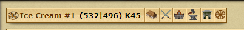

[◀️ back to overview](https://github.com/laicosvk/DSS#Downloads "back to overview")

# Quick select
Dieses Script fügt eine kleine leiste hinzu. 
es sind shortcuts zu bestimmten gebäuden. 
(Vergleichbar mit der Schnellleiste des Premiumvorteils)

## Details
| Programmierer | LaicosVK |
| :---: | :---: |
| Version | 1.2 |
| Loader | 1.0 |
| Aktualisierung | 10.01.23 |

## Changelog
### 1.2
-Neugeschrieben um es kleiner und sauberer zu machen. 
-Neue tabs können einfach hinzugefügt werden.
