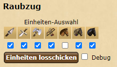

[◀️ back to overview](https://github.com/laicosvk/DSS#Downloads "back to overview")

# Raubzugrechner
Zeigt im Raubzug-Menü einen Buttom zum automatischen Abschicken von Raubzügen an. Es werden dabei die Einheiten so aufgeteilt, dass alle Raubzüge zur gleichen Zeit fertig werden. Es werden nur Einheitentypen verschickt, die ausgewählt wurden.

## Details

| Programmierer | Adrian |
| :---: | :---: |
| Version | 1.1 |
| Loader | 1.0 |
| Aktualisierung | 14.01.23 |

## Changelog

1.0 Erste Version
1.1 - Raubomatic speichert die Einheitenauswahl jetzt (localStorage)
 - Bessere Einbindung des Menüs auf der Seite.
