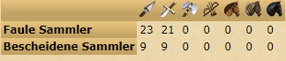

[◀️ back to overview](https://github.com/laicosvk/DSS#Downloads "back to overview")

# Raubzugrechner
Sobald im Raubzug Tab 2 Sammler freigeschaltet sind wird eine Tabelle eingeblendet. 
Die Tabelle zeigt dir wieviele Einheiten zu welchen Sammlern müssen, um in der kürzesten Zeit die meisten resourcen zu bekommen.

## Details

| Programmierer | LaicosVK |
| :---: | :---: |
| Version | 1.1 |
| Aktualisierung | 16.01.23 |

## Changelog

### 1.1:
- Autoupdate