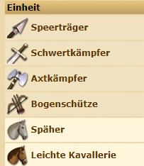

[◀️ back to overview](https://github.com/laicosvk/DSS#Downloads "back to overview")

# Training redirect
Sobald du auf den Stall oder die baracken klickst, wirst du automatisch weitergeleitet, um alle Einheiten ausbilden zu können. 
Nie wieder hin und her schalten!

## Details

| Programmierer | LaicosVK |
| :---: | :---: |
| Version | 1.1 |
| Loader | 1.2 |
| Aktualisierung | 13.01.23 |

## Changelog

# 1.1:
- Werkstatt hinzugefügt. (hab ich vergessen)
